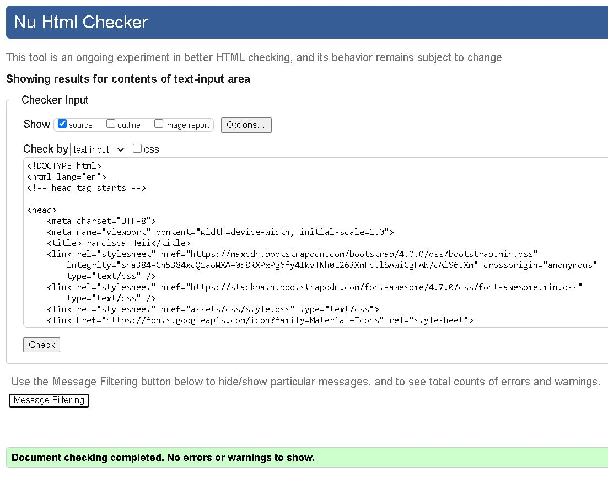

#  Milestone Project 1
## Pesrsonal Portifolio Website
Hi there!
 
This project is about building a static front-end Portifolio Website. The goal of the application is to display my education, skills, work 
history, to grow my network and also serve as a personal brand.The key primarily user of the website is the recruiter. Although other people 
can visit the site if catches their interest. The website allows potential recruiters to see my work, what I am capable of, what are my strengths 
and work history. This gives them a better understanding of how I may fit in with their vision or existing company culture.
This website also tries to address the convinience to share my work as more people are added to the interview panel.The website features about
me page, portifolio and contact page.

## UX

The key users for the site is the employer, searching to recruit a suitable candiate for the job available. Another goal is the ability to
easily add and update new projects when completed,skills and acomplishement to keep the site up to date. The recruiter can always re-visit the website at a 
later stage to check what new skills, or projects are added to the website since they last visited. 

### Visitors to the website want to achive the following:
* Search the candinadtes with the right skill set for the job available.
* To short list the relevant candinadtes for an interview.
* To be able to re-visit the website to check what the candinate have been up to.
* How to contact the candiate if they need to.

### This project is the best way to help them achieve this things because:

* The website has a clear and simple navigation for the user to find what they are looking for intuitively.
* The site itself shows my work and provides a tangiable proof of my skills and abilities, not just telling.
* The content is relevant and on point.

### Users stories
1. As a recruiter I want to see a Developer's portifolio site so that I can short list candiates for an interview.
2. As a recruit I want to see the menu bar so that I can easily navigate the website.
3. As a recruiter I want to see the candidate's bio, so I that can read more information about them.
4. As a recruiter I want to see education and history of the candiate so that I can know their level of experience.
5. As a recuiter I want to see the candidate's skills and any relevant competencies so that I can know if the're right fit for the job.
6. As a recruiter I want to see the candiate's projects so that I can see their work and how they can deliver
7. As a recruiter I want to download and print the candidate's CV so that I can refer to it during the interview
8. As a recruiter I want to see the candiate's contact information so that I can contact them.
9. As a recruiter I want to see the developer's social media links so that I can connect with them.

## Wireframe:

* [Home](assets/wireframes/home.png)
* [About](assets/wireframes/about.jpg)
* [Potfolio](assets/wireframes/Potfolio.png)
* [Contact](assets/wireframes/contact1.png)

## DESIGN:

 #### Color scheme

- The main colors used is green rgb(121,152,154) for the navigation bar and footer background. A dark shade grey rgb(48, 54, 52) for the button with a black color when hoover. For the card a light gray color rgb(211,211,211) is used.
Social links a dark shade grey rgb(48, 54, 52) is used with a orange color when hoover. 

### Typography
- Two main fonts are used, the first one is the Oswald fonts which is used in headings and the navigation bar.The second font is Lato, which is used in the paragraph content along with Sans Serif
as a fall back font, this means for some resons if Lato fails to load the Sans Serif will load up to back the failed font. The same idea
also applies with Oswald. Problem which can arise from this it could be that, the fonts is not loaded properly or issues with the time it takes
for the font to load there are actually various factors to this.

#### Imagery
- My profile picture.

## Wireframes:

##### MOBILE
* [home](wireframes/mob-home.jpg)
* [about](wireframes/mob-about.jpg)
* [portfolio](wireframes/portfolio-mob.jpg)
* [contact](wireframes/mob-contct.jpg)

##### IPAD

* [home](wireframes/ipad-hom.jpg)
* [about](wireframes/ipad-about.jpg)
* [portfolio](wireframes/portfolio-ipad.jpg)
* [contact](wireframes/ipad-contact.jpg)

##### DESKTOP

* [home](wireframes/desktop-hom.jpg)
* [about](wireframes/deskt-about.jpg)
* [portfolio](wireframes/portfolio-desk.jpg)
* [contact](wireframes/desktop-conatc.jpg)

### Features:

All the four pages features a fixed responsive navigation bar at the top with a logo on the left (Fran). You can click to go to any of the four
pages, whether the user is on home page, about me, portfolio or contact page, it doesn' matter what page the user is on. The site is easy to 
navigate. The four pages have the same footer where the user can see the download cv icon, copy right information and social links, on click of
each link, a new tab is open with the relevant social media homepage.

#### [home.html](index.html)
At the top of the page is a navigation bar with menu items on the right, and a logo on the left, when the page is viewed on Desktop and medium devices. When viewed on mobile devices at the top of the
page is a hambuger menu and a log (Fran) on the left.On click  of the hambuger menu the user can see a list of the menu items and they can click on each for information.
 The logo is clikable, when that ocuurs it brings the user to the home page.

 This page has a heading "Hi there!", below that is a brief introduction about myself, my name and what I do. The user can see my profile picture sitting on the right.
 Below the introduction is a button "read more",when clicked it takes the user to to the about me page.
Once the user hoovers over the button it goes black. 

At the bottom of the page is a clean, simple footer with a heading "need a printable version of my cv?" and a download here icon.When the user hoover over the download
icon a black backround color pops up with an orange color on the icon. When the user clicks the download icon it start downloading the cv and opens in a word document in a new tab.  

The user can then choose to print it out or save it for later use. In the middle is copy right information lastly social links with a black background. The user can see all the five social media links I'm on, when
hoover on each of the links it goes orange,once link is clicked it opens my social media account in a new tab. The user can close the social media page and when they do that they remain on the previous page they where
on.

#### [about.html](about.html)

At the top of the page is a navigation bar with menu items on the right, and a logo on the left, when the page is viewed on Desktop and medium devices. When viewed on mobile devices at the top of the
page is a hambuger menu and a log (Fran) on the left.On click  of the hambuger menu the user can see a list of the menu items and they can click on each for information.
The logo is clikable, when that ocuurs it brings the user to the home page.

Below the navigation bar is a heading “Why work with me”. Below that the user can see three blue background icons with text below them. The text is
meaningful, is to help communicate the concept of the icons in relation to my website so that the users can easily understand the meaning behind the three icons.

The first icon “fast” symbolise, fast load times and lag free interaction which are my highest priority when building applications.  The second icon is “responsive”, 
showing that I keep in mind my layouts to work on any device, big or small. The third icon “intuitive”, which means when a user land on my site they know exactly what to do, 
they can easily find what they want.

The next section is a heading “About me” below that they are four short paragraphs about myself and my history. This gives the user a brief idea who am I, so that they can 
get an idea of my personality. On the last paragraph there is a link to my linkedin profile. When the user hoovers over the link a blue underline pops up. When the link is clicked
it opens my linkedin profile in a new page so that the user can see more information they want to see about myself.The user can close the linkedin page to return to the website.

The next section is a heading “Skills”. The user can clearly see my proficiency level.

- HTML5 with a red backround color is 80% 

- CSS3 with a blue background color is 70%

- Bootstrap a green background color is 60%

- Version control a yellow background color is 50%

This gives the user a picture on the proficiency level I have working on different technologies so that they can have a certain amount of confidence in me.

At the bottom of the page is a clean, simple footer with a heading "need a printable version of my cv?" and a download here icon.When the user hoover over the download
icon a black backround color pops up with an orange color on the icon. When the user clicks the download icon it start downloading the cv and opens in a word document in a new tab.  

The user can then choose to print it out or save it for later use. In the middle is copy right information lastly social links with a black background. The user can see all the five social media links I'm on, when
hoover on each of the links it goes orange,once link is clicked it opens my social media account in a new tab. The user can close the social media page and when they do that they remain on the previous page they where
on.

#### [portfolio.html](portfolio.html)

At the top of the page is a navigation bar with menu items on the right, and a logo on the left, when the page is viewed on Desktop and medium devices. When viewed on mobile devices at the top of the
page is a hambuger menu and a log (Fran) on the left.On click  of the hambuger menu the user can see a list of the menu items and they can click on each for information.
The logo is clikable, when that ocuurs it brings the user to the home page.

At the top is a heading title “ Below you can find some of the project I have been working on lately”. Below the heading is two images about the projects I have worked on lately.
On the left, is a Library management system image and below the image is a heading “Distributed system. Below that is a brief paragraph to explain to the user what is a “Distributed system and the benefits it brings in an organisation so that
the user can understand what is the main purpose of the project which is to solve a problem in an organisation.

Below the paragraph is a heading “Technology” below that is an exaplanation on technologies used to build the application. Then next is a button indicating go to app. When the user hovers over the button it goes black and when clicked it opens into a new tab.
Currently the website is being re-developed and it will be difficult for the user to understand what is going on. The user can close the tab, when they do that they remain right at the previous position on the portfolio page where they were at before they clicked the button.

On the right hand side, the user can see the second image about Online food delivery. Below the image is a heading “Online food delivery”, below that is a brief paragraph to explain to the user what the application is all about so that the user can understand what it does, how it works and
who are the targeted users. Below the paragraph is a heading “Technology” below that is a paragraph explaining the technologies used to develop the application so that the user can know them.  PHP was used for logic in backend, MySQL to develop a database, Bootstrap, HTML5 and CSS3
was used for front end development.

Then next is a button indicating go to app, when user hovers over the button goes black and when clicked it opens into a new tab and lands on the home page.The user can navigate the food fun website, can place order or track order.
If the user has a restaurant and want to sell their food items, they have to be registered first. The user can simply click on “resturants” on the navigation bar and follow the steps. When the user close the tab they remain on the portfolio page at the previous position they were before and 
they can continue to navigate the site. 

The next section is the heading work history with three timeline sections showing the year when the develpoer started work , the role played and nature of duties. The user can have an idea about the level of experience the develop has so that the recruiter can decide if the 
developer is good fit for the job or not.

At the bottom of the page is a clean, simple footer with a heading "need a printable version of my cv?" and a download here icon.When the user hoover over the download
icon a black backround color pops up with an orange color on the icon. When the user clicks the download icon it start downloading the cv and opens in a word document in a new tab.  

The user can then choose to print it out or save it for later use. In the middle is copy right information lastly social links with a black background. The user can see all the five social media links I'm on, when
hoover on each of the links it goes orange,once link is clicked it opens my social media account in a new tab. The user can close the social media page and when they do that they remain on the previous page they where
on.

#### [contact.html](contact.html)

At the top of the page is a navigation bar with menu items on the right, and a logo on the left, when the page is viewed on Desktop and medium devices. When viewed on mobile devices at the top of the
page is a hambuger menu and a log (Fran) on the left.On click  of the hambuger menu the user can see a list of the menu items and they can click on each for information.
The logo is clikable, when that ocuurs it brings the user to the home page.

This page has a card with a background color of light gray. At the top is a heading that asks the user if they want to know more about the developer? Below that is a heading “contact me” and a 
form below it. The form takes a user name, email and a message. When the user clicks any of the fields in a form a thick blue border pops up telling the user what is required in that particular so that 
they can tpye the information required in the relevant text box.

 The form is validated to make sure that the user fills all the sections before they click the submit button. If the user try to 
skip any of the fields and click the submit button, they will get an alert message “please fill out this field” and they can go back and fill that particular field first. When the user clicks the submit button
 the form gets submitted successfuly. On the right hand side is the contact details which the user can use if the need to contact the developer for any other information. The user can chose to contact the developer
 by email, phone number or filling out the form. 

 At the bottom of the page is a clean, simple footer with a heading "need a printable version of my cv?" and a download here icon.When the user hoover over the download
icon a black backround color pops up with an orange color on the icon. When the user clicks the download icon it start downloading the cv and opens in a word document in a new tab.  

The user can then choose to print it out or save it for later use. In the middle is copy right information lastly social links with a black background. The user can see all the five social media links I'm on, when
hoover on each of the links it goes orange,once link is clicked it opens my social media account in a new tab. The user can close the social media page and when they do that they remain on the previous page they where
on. 

## Features left to implement

- To re-develop and finish the Library managent system so that the user can navigate through the site and see what it does and how it does it.
- To build a block and link it to my portfolio site and showcase my passion for technology.

## Technologies used

- [GitHub](https://github.com/)

    - The flatform used to host the project 

- [Gitpod](https://www.gitpod.io/)

    - A software/IDE used to build the website

- [HTML5](https://en.wikipedia.org/wiki/HTML5) and [CSS3](https://en.wikipedia.org/wiki/CSS)

    - Html5 was used to structure and present content in the site while CSS3 was used for layouts, and styling.

- [Bootstrap](https://getbootstrap.com/)CDN

    - Used bootstrap to structure the website, list groups, card and to promote responsiveness of the application.

    -  The project also uses popper.js from bootstrap, to reference javascript needed for responsive navigation bar.

- [jQuery]( https://jquery.com/)

    - jQuery to reference javascript required for the responsive navigation bar.

- [Google Fonts](https://fonts.google.com/)  

    - Was used to choose a font style for the website, where we see Oswald font used for headings and Lato for paragraphs.

- [Font Awesome](https://fontawesome.com/) 

    - Used to for the social link icons.

    
- [Material Icons](https://material.io/resources/icons/?style=baseline)

    - Material icons was used for web icons to symbolise "Fats", "responsive" and "intuitive".

- [Chrome Developer Tools](https://developers.google.com/web/tools/chrome-devtools)  

    - To visualize different elements and the code they produce, edit pages on the-fly and to diagnose quickly, and test responsiveness of the website.

- [Figma](https://www.figma.com/)

    - Used to create wireframes for the website.

- [Jigsaw](https://jigsaw.w3.org/css-validator/)  

    - Used to check for any errors in css code.

- [W3C Markup Validator](https://validator.w3.org/)  

    - To check for any errors in HTML code.

- [Removebg](https://www.remove.bg/)  

    - Used to remove background on my profile picture.

- [AM I Responsive](http://ami.responsivedesign.is/)   

    - Was used to see how the website looks across a few different viewports. For example desktop, laptop, tablet and mobile. 

### Testing

Find testing of the site [here](TESTING.md) 

Used [W3C HTML Validator](http://ami.responsivedesign.is/) 

1. index.html results after validation

No error detected

2. about.html results after validation

No error detected

3. portfolio.html results after validation

No error detected

4. contact.html results after validation

No error detected

5. style.css results after validation

Error detected

### User stories

- As a recruiter I want to see a Developer's portfolio site so that I can short list some developer’s for an interview.

    - First thing if the site url is put into the browser, when the browser finishes loading the page the site is now visible to the user and on landing page.

    - The user can see the site colour scheme with a simple clean layout. They can see a fixed navigation bar at the top, an introduction about myself, my profile picture and a “read more” dark grey background button with a black colour on hoover.
    - On click of the buttons it takes the user to the about me page. From landing page the user can choose where they want to start.

 - 	As a recruit I want to see the menu bar so that I can easily navigate the website.  

    - On landing page the user can easily find a fixed navigation bar at the top so that they can navigate through the website. 
    - On click of the logo (Fran) the user will always land on the home page. Whatever page the user is on, the navigation bar is fixed. sometimes as a user scrolls down the page sometimes they can change their mind and decide to go to a different page. 

    - They can simply do so by just one click on the navigation bar to the page they want to go to. When the user hoovers on each menu item the text colour changes to a light grey colour. 
    - When the user clicks on the read more button it leads them to the about me page.

 - As a recruiter I want to see the candidate's bio, so I that can read more information about them.

    - There are two ways here, from the landing page the user can click on the “read more” button and it will take them to the about me section. Another way the user can click “about me” link from the navigation bar. and cl it takes them to the about me section. 
    - The user can see the site consistency of the colour scheme with a simple and neat layout. Below the navigation bar is a heading “why work with me” The icons are well spaced  with a brief description below each one.
    - In this section the user get to know who I’m I. The user can easily scroll down the page to read my bio, as they continue reading they can click the LinkedIn link if they want to check out my profile, this will open in a separate tab. 

  -	As a recruiter I want to see the developer’s education and history so that I can know their level of experience.  

    - When the user is anywhere on the page can navigate to the portfolio by clicking on portfolio link from the navigation bar. Then can scroll down the page to where there is a heading “work history” and find timeline of my work history.
    - For additional information about my education they can visit my LinkedIn profile on the about me page or they can simply download a copy of my cv from the footer to see my education level.

 - As a recruiter I want to see the candidate's skills and any relevant competencies so that I can know if they’re right fit for the job.
    - Go to the about me section scroll down the page and you will see  a heading “skills” and a sub heading “proficiency level” showing the developers skills. The user can see a clear proficiency level about the technologies the developer has worked with.
    - This is shown in a scroll bar starting with the highest level, htlm5 at 80%, CSS at 70%, bootsrap at 60% and version control at 50%.

    - Additionally the user can  find more information under the heading “about me” they can scroll up the page to read the developer’s bio to see if they have any relevant competencies for them to know the candidate can fit well for the job.

- As a recruiter I want to see the developer’s projects so that I can see their work and how they can deliver.

    - The user can be anywhere on the page and can navigate to the portfolio page where they will see a heading “ Below you can see the projects have been working on lately” The user will see a brief description about the projects and technologies used for each project.

    -  The user can click the button “go to app” or “go to github” button to find out how the projects were delivered .They can also make use of the current portfolio site as additional information.

- As a recruiter I want to download and print the Developer’s CV so that I can refer to it during the interview session.

    - The user can be anywhere on the site, they have to scroll down to the footer section. There is heading “need  to download a printable version of my cv download it here” The user can click  the white download icon to start downloading.

    - When the user mouse over the download icon if pops out a black background colour with an orange icon. The user can then decide to print or save the CV somewhere to have it ready during the interview.
    - When the download is complete it will open in a word document in a separate page. 

- As a recruiter I want to see the developer’s contact information so that I can contact them.  

    - A clear labelled contact page is easy to find from the navigation bar.  On click of the link it takes the user to the form and they can fill it. 

    - The form is validated so that the user has to fill in the correct information. If the user tries to submit an empty form or if the form is not filled correctly, when  they click “submit “ button an alert message pops up which say “please fill out this field” indicating the area to type on.

- As a recruiter I want to see the developer's social media links so that I can connect with them.

    - Again the user can be anywhere on the site, the user need to scroll down to the footer section  and they can see all the social media links the developer’s on. The developer is on five social links that is facebook, twitter, linkedin, Instagram and github.

    - The user can choose which links they are more interest in. All the links have dark grey colour, on hoover they have an orange colour. All the links open in a new tab so that the user does not forget about the website.

 
        

 

  

